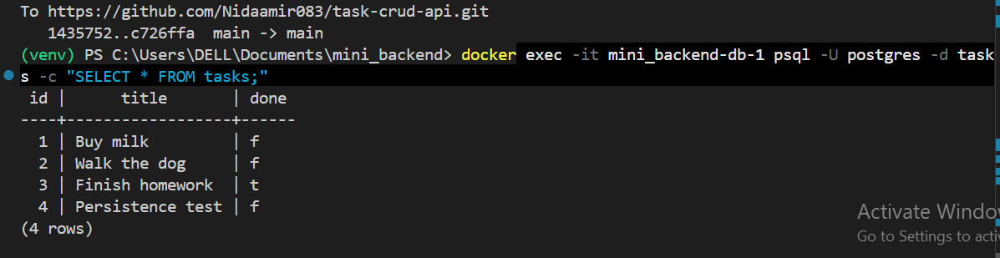
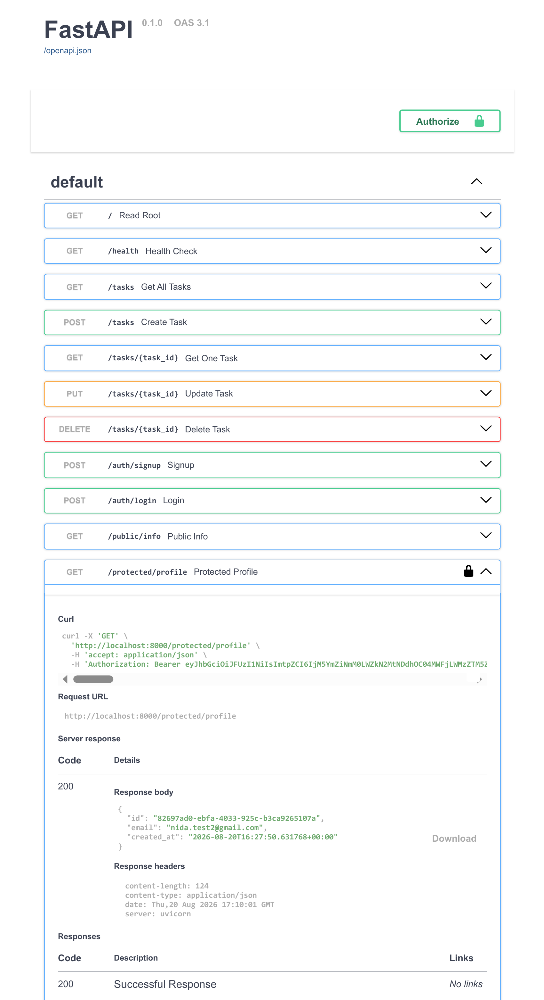

# Task API

A small CRUD API built with **FastAPI** that manages a to-do list of tasks. Built as part of the FlyRank Backend Internship — Week 1 (Assignment A1: in-memory version), Week 2 (Assignment A2: SQLite database version), and Week 3 (Assignment A3: containerized PostgreSQL version, this one).

Data now lives in a **PostgreSQL database**, running inside a **Docker container**. The whole stack — app and database — starts together with a single command.

## Why PostgreSQL + Docker?

SQLite worked well for a single file on one machine, but PostgreSQL is what real backends use in production — a proper database server that many programs can connect to at once. Docker means you don't install Postgres directly on your computer; instead you run its official image, and it behaves the same way on any machine. This is the same setup used by real companies, including FlyRank itself.

## Where the data lives

- Data is stored inside a Postgres database, in a Docker **volume** named `taskdata` — this means your rows survive even if the containers are stopped and removed.
- The `tasks` table is created automatically the first time the app starts, and seeded with 3 example tasks — only if the table is empty.
- The database password lives in a `.env` file (git-ignored) — never hardcoded in the code. A `.env.example` file is committed so you know which variable to set.

## How to run this

**Requirements:** Docker Desktop (free) — no need to install Python or Postgres separately.

```bash
# 1. Clone this repo
git clone https://github.com/Nidaamir083/task-crud-api.git
cd task-crud-api

# 2. Copy the example env file and use it as-is (or change the password if you like)
cp .env.example .env

# 3. Start the whole stack — app and database — with one command
docker compose up
```

The API will be available at **http://localhost:8000**

> Note: on some Windows/Docker setups, `127.0.0.1` can hang due to a WSL2 networking quirk — use `localhost` instead, which works reliably.

On first run, the `tasks` table is created automatically with 3 seeded example tasks. Restarting the stack does not duplicate them, and your data survives a full `docker compose down` + `docker compose up` because of the `taskdata` volume.

Interactive API docs (Swagger UI) are available at **http://localhost:8000/docs**

To stop everything: press `Ctrl + C`, then run `docker compose down` (your data stays safe in the volume).

## Endpoints

| Method | Path            | Description                        | Success | Errors        |
|--------|-----------------|-------------------------------------|---------|---------------|
| GET    | `/`             | Basic info about this API           | 200     | –             |
| GET    | `/health`       | Check if the server is alive        | 200     | –             |
| GET    | `/tasks`        | List all tasks                      | 200     | –             |
| GET    | `/tasks/{id}`   | Get a single task by id             | 200     | 404           |
| POST   | `/tasks`        | Create a new task                   | 201     | 400           |
| PUT    | `/tasks/{id}`   | Update a task's title and/or done   | 200     | 400, 404      |
| DELETE | `/tasks/{id}`   | Delete a task                       | 204     | 404           |

These endpoints and status codes are unchanged since Assignment 1 — only the storage underneath changed, first from an in-memory list to SQLite, and now to PostgreSQL running in Docker. This proves storage really is just an implementation detail.

## Example request

```bash
curl -i -X POST http://localhost:8000/tasks \
  -H "Content-Type: application/json" \
  -d '{"title":"Buy milk"}'
```

**Response:**

```
HTTP/1.1 201 Created
content-type: application/json

{"id":4,"title":"Buy milk","done":false}
```

## Exploring the database directly

You can look inside the running Postgres container using `psql`, the command-line SQL prompt:

```bash
docker exec -it mini_backend-db-1 psql -U postgres -d tasks -c "SELECT * FROM tasks;"
```



## Swagger UI

All endpoints are documented and testable at `/docs`:



## Notes

- Data is stored in PostgreSQL, inside a Docker volume, and survives both server restarts and full container teardowns.
- Both `POST` and `PUT` validate that `title` is not empty, returning `400 Bad Request` if it is.
- Requesting a task id that doesn't exist returns `404 Not Found` with a JSON error message.
- All database queries use parameterized placeholders (`%s`) instead of inserting values directly into SQL strings, to keep the database safe from malformed or malicious input.
- The database password is never hardcoded — it's read from `.env` (git-ignored) at startup.

## AI vs me (Assignment 1 bonus)

**My prompt to the AI:**

> This is built in python in vs code, i have used fast api and import it first, the doors in my api are tasks, put, update, delete basically there are 7 doors. the url path is task 1, 2, all tasks and docs. 200 is the number for successful creation while 404 is for successful delete. 404 is when something not found. If I do not write anything in between "" this it remains empty and return invalid. The data lives in database, it should not survive when server restarts. Yes there is an interactive docs page and it should be found on the link given.

**What the AI did better:**
Nothing structurally — it produced a much simpler, shorter file than mine, but that's not "better," it's because it followed my prompt literally, gaps and all. I fully understand the AI's version; it's actually simpler than mine because it skips validation status codes and Pydantic models.

**What it got wrong or quietly ignored:**
- I told it 200 for "successful creation" and 404 for "successful delete" — both are backwards from real convention (should be 201 and 204). The AI didn't correct me, it just followed my mistake, which means a *successful* delete and a *not found* error now return the exact same status code.
- I never gave a status code for invalid (empty) input, so the AI just returned a normal 200 response with an error message buried inside it — the same "polite lie" problem I fixed back in Stage 2 of my own build.
- I said data "lives in a database" but also "should not survive restart" — a real contradiction. The AI silently picked in-memory storage and ignored the word "database" without telling me it was resolving a contradiction.
- It skipped the `/` and `/health` endpoints entirely, since I never mentioned them in this prompt.

**What my prompt forgot to specify — and what the AI silently decided:**
- I never said how data should arrive (JSON body vs. query parameter) — the AI chose to accept `title` as a raw parameter instead of a proper JSON body.
- I never asked for validation error *messages*, so it returned a bare `{"error": "invalid"}` instead of a helpful message.
- I never mentioned docstrings/descriptions, so none were added, even though my real Swagger docs have them.

**One-sentence takeaway after improving the prompt:**
When I rewrote the prompt with the *correct* status codes (201 create, 204 delete, 400 invalid, 404 not found) and specified JSON body input, the regenerated version matched my hand-built logic almost exactly — proving the original gap was entirely due to my prompt, not the AI's capability.
